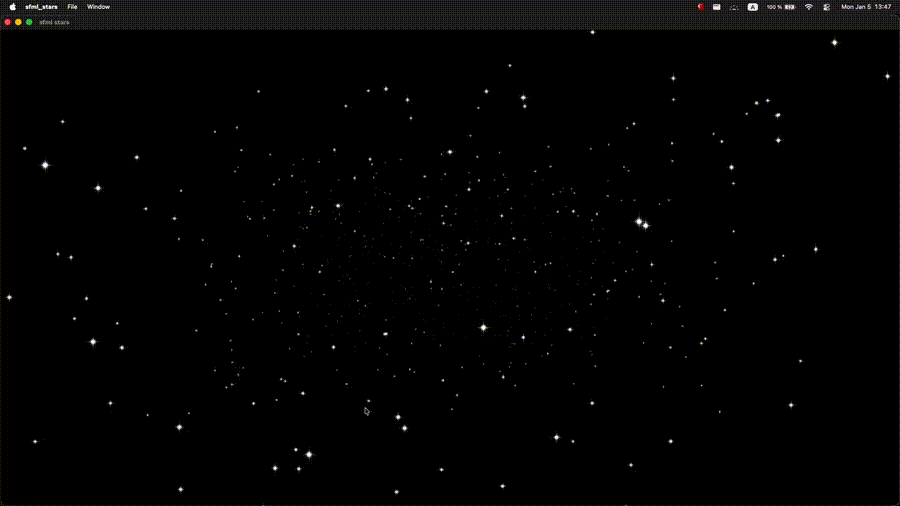

# sfml stars 

This project is not exact but 95% copy of https://www.youtube.com/watch?v=t0z3RojiKFg .
I strongly encourage you to check Pezza's work I really enjoy it watching it. 

I code this as my first foot in SFML. 

## Demo 



## Project Structure 

```markdown
    sfml_stars/
    ├── assets/
    │   └── star.png
    ├── src/
    │   ├── entity/
    │   │   └── stars.hpp
    │   └── main.cpp
    ├── CMakeLists.txt
    └── README.md
```


## Building

```shell
    brew update
    brew install cmake sfml
    mkdir -p build
    cd build
    cmake ..
    cmake --build . -j
    cp assets ./build
    ./build/sfml_stars
```